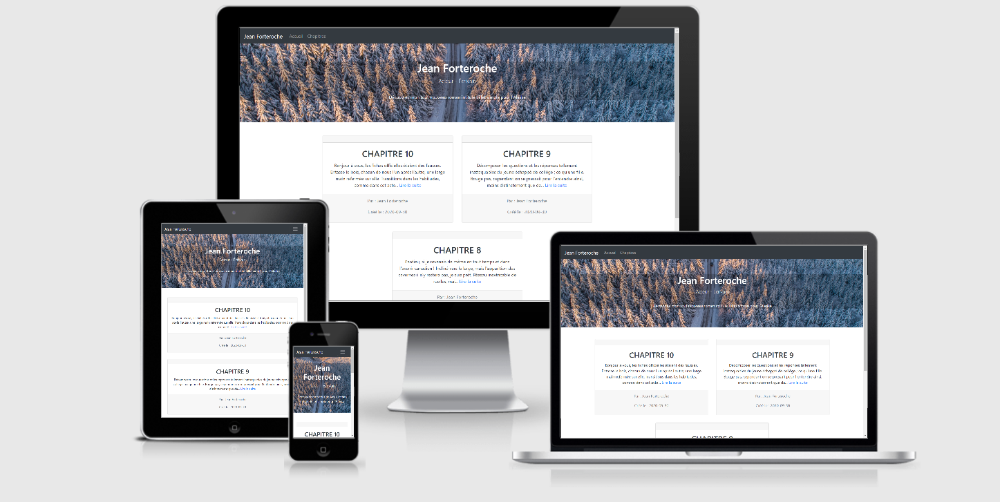

# Jean Forteroche Projet 4 (OpenClassrooms)
> Développement d'une application de blog en PHP MVC avec une base de données, en utilisant tous les éléments d'un CRUD. 
>- Create : création de billets
>- Read : lecture de billets
>- Update : mise à jour de billets
>- Delete : suppression de billets
>
>L'application fournie une interface front-end (lecture de billet), chaque billet permet l'ajout de commentaire et l'utilisateur peut signaler les commentaires pour que ceux-ci remontent plus facilement dans l'interface d'administration pour être modérés. Une interface back-end, protégée par un mot de passe, la rédaction de billets se fera dans une interface WYSIWYG.
>
> [JeanForterocheProject](https://jeanforterocheproject.psamelhori.fr/)

## Screenshots
